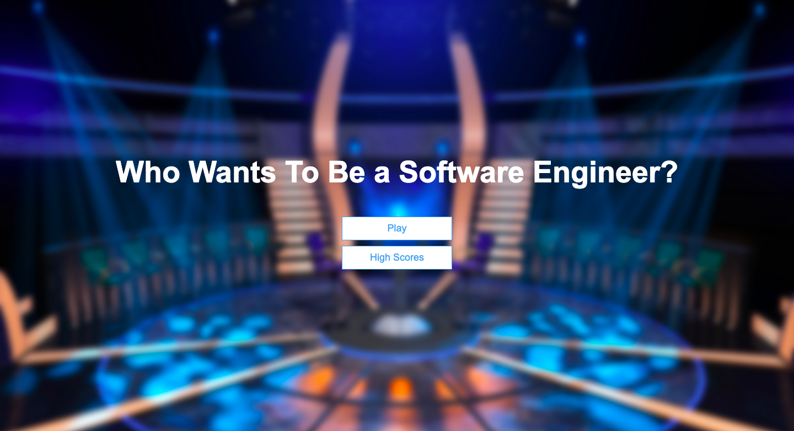

# Who Wants To Be a Software Engineer?

Explanation of the game that was built and the deployed link will go here.

Who Wants To Be a Software Engineer (WWTBSE) is a single player trivia game, that you can win by getting at least 5 questions right/recieve a score of 500 and above. 

Access the live deployed game:
https://bgiorgi1.github.io/WhoWantsToBe/


# HOW TO PLAY
This game is played by:
1) Clicking the "start" button on the first screen displayed.

2) You will then be presented a question with four choices.  From here, you select which answer you think is correct.

3) Once you select your answer, you click "next" button to access the next question.
4) You continue to answer 10 questions.  Once you reach the last question, a pop up will appear notifying you of your win or loss. 
5) From here, you may select "try again" in order to play the game again.


## Start Up Screen:
Images of the start up screen go here 

# HOW TO INSTALL

## Example
1. *`Fork`* and *`Clone`* this respository to your local machine
2. Open `index.html` in your browser to play or 
3. Open the directory in your text editor of choice to view or edit the code

# HOW IT WORKS
How the game works will go here
Code snippets go here
After the questions were complete, I added a function so that they would light up green or red depending on whether your answer was correct or not:
```javascript
 function clickNext(questionNumber, quiz){
    if (questionNumber + 1 < 10) { //quiz.length
        //whether they get it right or worng, it's going to continue to loop until max questions has been reached(10)
        for(let i=0; i<choices.length; i++) {
            choices[i].classList.remove("incorrect");
            choices[i].classList.remove("correct");
        } showQuestions(questionNumber + 1, quiz);
      } else {
          gameFinal ()
      }
  }
```
If you get the question correct, the button lights up green

If you get the question wrong, the button lights up red.


The last part of this project was adding a modal to display whether you won or lost.
```javascript
function gameFinal (){
    if (score >= 500){
    modalText.textContent = "You Win! You are a software engineer!"
    modal.style.display = "block";
} else {
    modalText.textContent = "You Lose!"
    modal.style.display = "block";
}
}
```
If you lose the game, You recieve a message that you lost, with a button to try again.

If you win the game, you recieve a message that you won, with a button to try again.


# FUTURE CONSIDERATIONS
Going forward I would like to add:
-[] A progress bar in the upper left hand corner that visually relects how many questions you have left.
-[] A high score end page
-[] A timer to complete the game in less than 2 minutes

# PROCESS WORK

